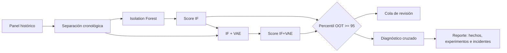
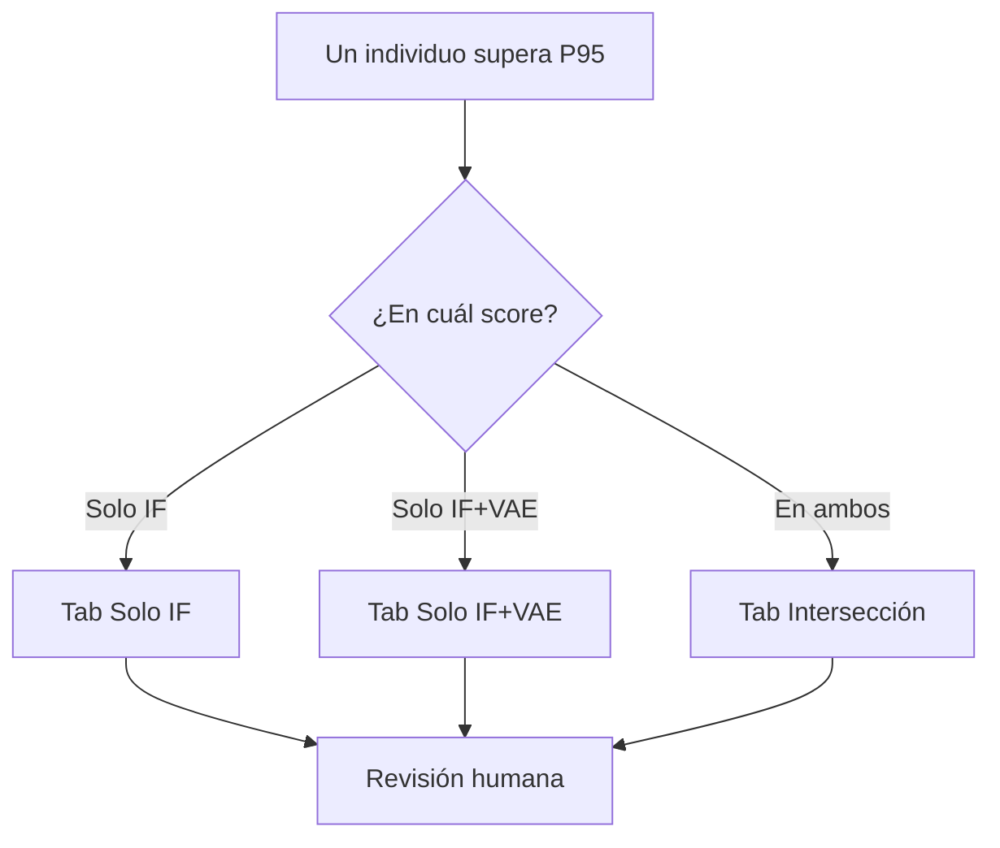
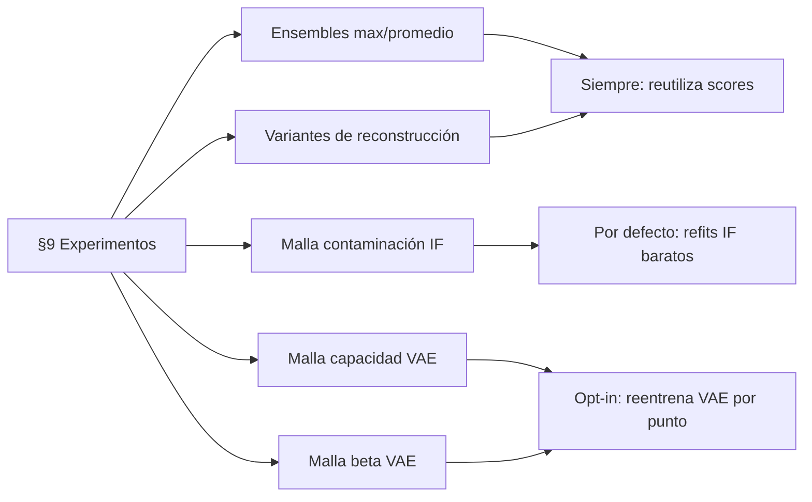

# Guía práctica: del dato a una alerta revisable

Esta es la entrada recomendada para lectores no especializados. Explica qué
hace el sistema, cómo leer sus salidas y qué opciones activan diagnósticos más
costosos. Las guías técnicas enlazadas al final conservan el detalle de
implementación.

## El recorrido completo en una imagen



La regla más importante es temporal: el modelo aprende con meses anteriores y
se evalúa en los últimos meses OOT (*out of time*). Así se parece a la situación
real de puntuar un mes futuro que todavía no se conocía al entrenar.

## Cuatro conceptos sin jerga

### Isolation Forest: aislar al que se separa rápido

Imagina que divides una sala al azar una y otra vez. Una persona muy apartada
queda sola con pocos cortes; una persona dentro del grupo necesita muchos. El
Isolation Forest repite ese juego con muchos árboles. En este proyecto, un
score mayor significa “más inusual”.

Ejemplo: si casi todas las cuentas realizan entre 2 y 20 transferencias y una
realiza 300, esa fila probablemente queda aislada pronto. Esto es una señal de
revisión, no una prueba de fraude.

### VAE: reconstruir lo habitual y medir lo que no encaja

Un VAE es un compresor con incertidumbre: resume una fila en pocas dimensiones
latentes e intenta reconstruirla. Aprende bien los patrones frecuentes. Si una
fila vuelve muy distinta de la original, su error de reconstrucción aumenta.

Ejemplo: el VAE puede aprender que cierto saldo, ingreso y número de productos
suelen aparecer juntos. Una combinación nueva puede tener valores individuales
razonables y aun así ser difícil de reconstruir.

### Stacking IF → VAE: una segunda opinión que recibe la primera

Con `--stack-iforest-into-vae`, el score IF se añade como una entrada del VAE.
No es una votación automática: el VAE puede usar mucho, poco o nada esa señal.
Por eso el dashboard conserva ambos rankings y muestra su intersección.

### Percentil OOT: prioridad relativa, no probabilidad

P95 significa que el score está entre el 5% más alto de la población OOT. No
significa “95% de probabilidad de fraude”. Si hay 10 000 personas OOT, P95
produce aproximadamente 500 casos antes de considerar empates.



## Cómo ejecutar lo habitual

La suite diagnóstica está activa por defecto. Si `ifvae_diag` todavía no es
importable, el pipeline instala automáticamente la copia vendorizada en
`tools/if_vae_diagnostic_suite`; no hace falta ejecutar `pip` a mano.

```powershell
python main.py --quick --no-tune
```

Para validar una máquina sin permitir esa instalación automática:

```powershell
python main.py --quick --no-tune --no-auto-install-suite
```

En ese modo la fase diagnóstica informa claramente que la suite no está
disponible; no intenta descargar un paquete por nombre desde internet.

## Seguir la suite diagnóstica mientras corre

La Fase 9c es la parte más lenta del diagnóstico porque reajusta los detectores
con otras semillas. Para saber qué hace y cuánto lleva, hay tres lugares
(todos muestran lo mismo):

- **Dashboard de consola** (por defecto en una terminal): bajo la fase actual,
  la línea `↳ función` lista las funciones en ejecución con su tiempo, y debajo
  hay una barra por cada prueba en curso, por ejemplo:

  ```
  ↳ función  ifvae_diagnostic._build_stability 03:12 › ifvae_diagnostic.refit[VAEDetector seed=2042] 01:05
  ▸ ifvae_diagnostic:  45%|████▌     | 5/11 [03:12<03:52, 38.4s/prueba, ifvae_diagnostic._build_stability]
  ▸ stability_refit[VAEDetector]:  33%|███▎      | 1/3 [01:05<02:10, 65.2s/refit, seed=2042]
  ```

  Un cronómetro que sigue creciendo con las barras quietas indica que esa función
  está trabajando mucho tiempo o atascada; si avanza, el ritmo y la ETA lo dicen.
- **Vista web local** (se abre sola; `--no-live-view` la desactiva): paneles
  *Function running*, *Progress of running tests* y *Last finished functions*.
- **Terminal sin dashboard** (`--no-console-ui`, o salida redirigida): barras
  tqdm reales en la terminal, más las líneas `Starting/Finished <función> in Ns`
  en `artifacts/logs/execution.log`.

Cada prueba de la suite es una barra: los 12 pasos de `run_diagnostic`, las 11
pruebas del puente, y bucles internos como `isolation_forest[seeds]`,
`compare_populations[features]`, `stability_refit[...]` o
`experiment[...]`. Para acortar la espera, baja `--diagnostic-stability-refits`
o deja vacías las mallas opt-in del apartado 9.

## Activar la segmentación del apartado 8

El valor por defecto es una columna llamada `segment`. Para usar una columna
propia —por ejemplo `region`—:

```powershell
python main.py --diagnostic-segment-column region
```

La columna debe existir en el panel original. Si no existe, el pipeline emite
un warning y la tabla queda `NOT_APPLICABLE`. Para desactivar deliberadamente
la segmentación, pasa una cadena vacía (en PowerShell):

```powershell
python main.py --diagnostic-segment-column ""
```

Ejemplo: si `region` contiene Norte, Centro y Sur, el apartado 8 compara las
tasas de alertas IF, IF+VAE y su intersección en esos tres grupos. Una diferencia
describe el resultado observado; no prueba por sí sola sesgo o peor calidad.

## Qué experimentos ejecuta el apartado 9



La malla IF predeterminada es `0.01 0.02 0.05`. Puede reemplazarse o
desactivarse pasando el flag sin valores:

```powershell
python main.py --diagnostic-experiment-contamination-grid 0.005 0.01 0.03
python main.py --diagnostic-experiment-contamination-grid
```

Capacidad latente y beta son opt-in porque cada punto reentrena un VAE completo:

```powershell
python main.py --diagnostic-experiment-capacity-grid 4 8 16 `
               --diagnostic-experiment-beta-grid 0.1 0.5 1.0
```

Las familias que requieren cambiar el modelo, el preprocesamiento o conservar
múltiples ventanas históricas quedan `NOT_REQUESTED` con un motivo específico.

## Cómo leer los tres entregables

- `analyst_dashboard.html`: abre una de las tres pestañas, selecciona una fila
  y revisa scores, variables explicativas y meses. El botón del perfil descarga
  todas las filas OOT del individuo con todas las columnas originales en CSV.
- `anomaly_report.html`: separa hechos e interpretación. “Qué no se ejecutó o
  falló” aparece solo si hubo errores reales; los warnings se omiten para no
  ensuciar el reporte. §9 conserva los estados no solicitados con su motivo.
- `documentation.html`: consolida esta guía, el contexto, el historial y las
  referencias técnicas. Los diagramas Mermaid se muestran como SVG cuando el
  navegador tiene red y conservan su fuente legible cuando no la tiene.

## Siguiente nivel de detalle

- Isolation Forest: `docs/models_isolation_forest.md`.
- VAE: `docs/models_vae.md`.
- Separación temporal y fuga: `docs/leakage_free_pipeline.md`.
- Métricas y OOT: `docs/evaluation.md`.
- Interpretabilidad y reportería: `docs/interpretability_and_reporting.md`.
