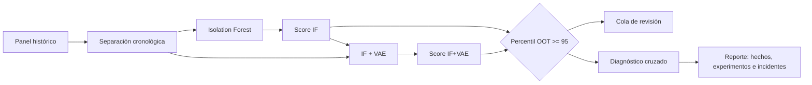
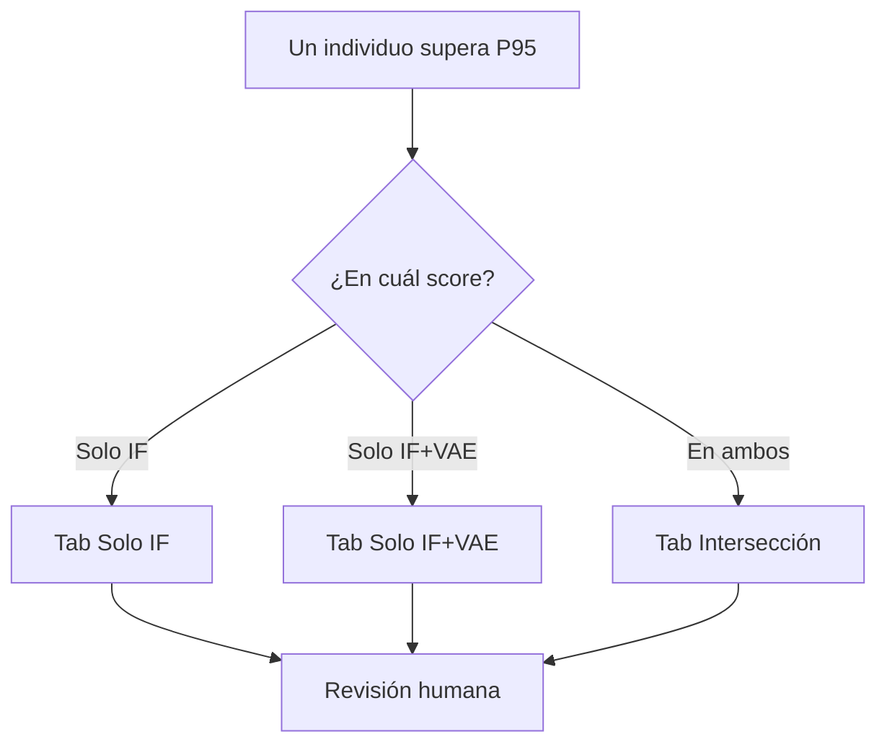
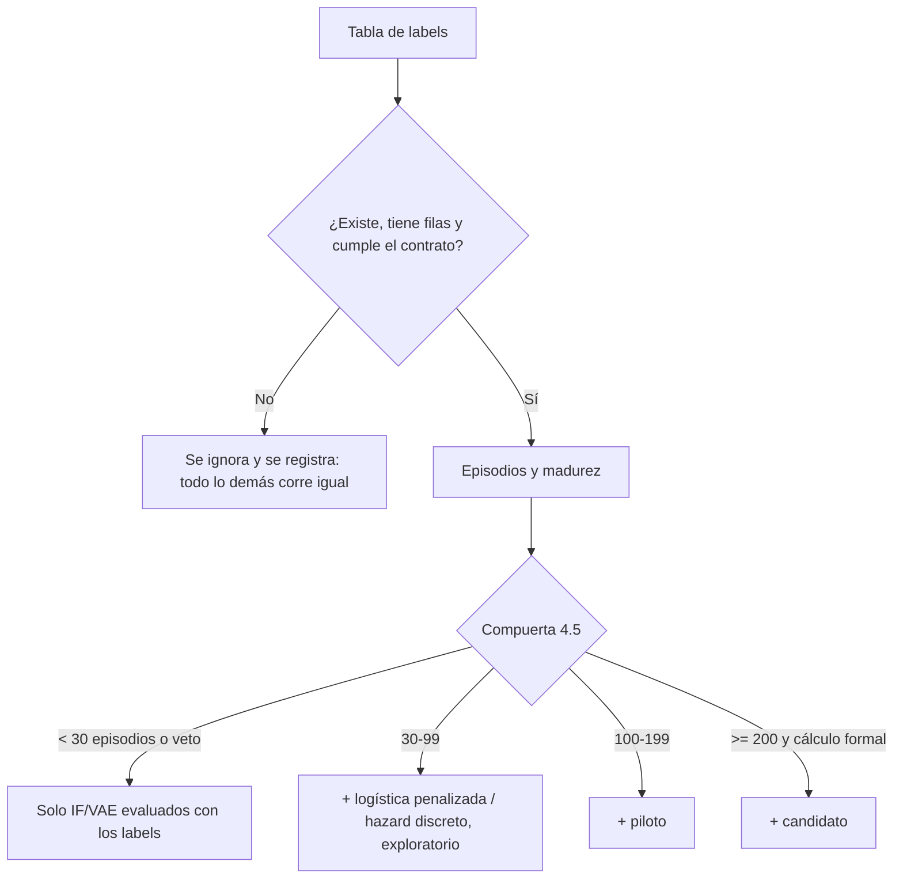
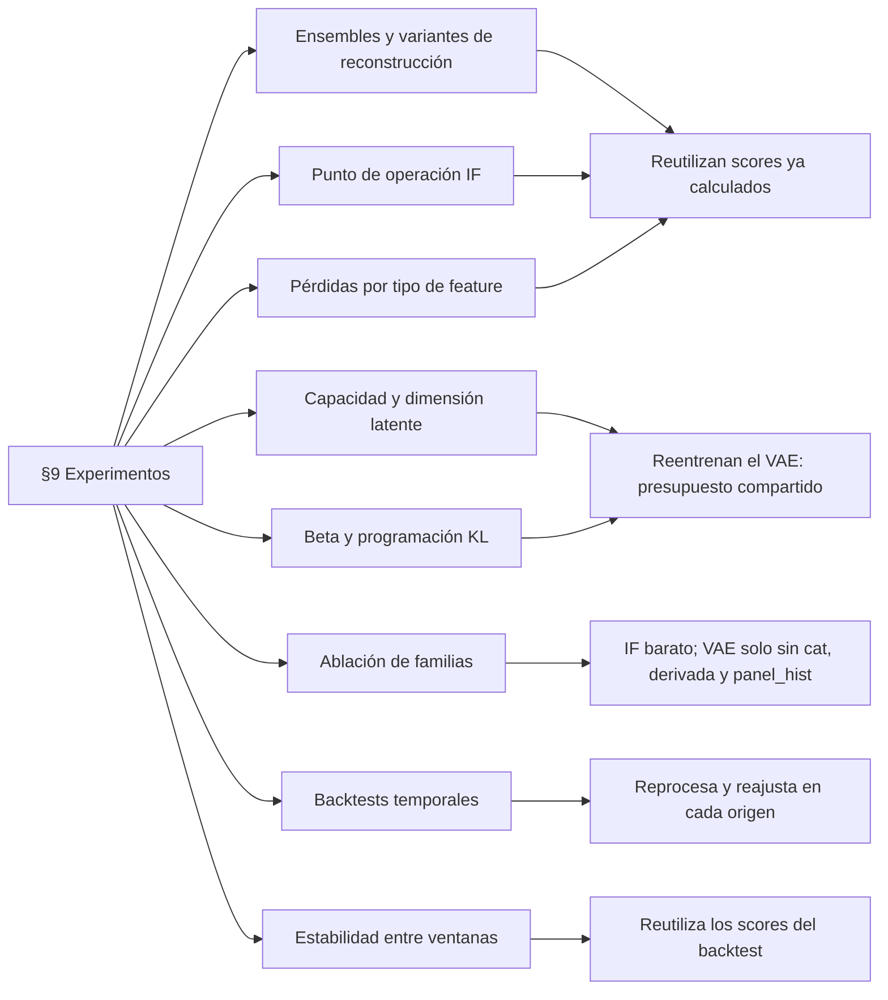

# Guía práctica: del dato a una alerta revisable

Esta es la entrada recomendada para lectores no especializados. Explica qué
hace el sistema, cómo leer sus salidas y qué opciones activan diagnósticos más
costosos. Las guías técnicas enlazadas al final conservan el detalle de
implementación.

## El recorrido completo en una imagen


```mermaid
flowchart LR
    A[Panel histórico] --> B[Separación cronológica]
    B --> C[Isolation Forest]
    C --> D[Score IF]
    D --> E[IF + VAE]
    B --> E
    E --> F[Score IF+VAE]
    D --> G{Percentil OOT >= 95}
    F --> G
    G --> H[Cola de revisión]
    G --> I[Diagnóstico cruzado]
    I --> J[Reporte: hechos, experimentos e incidentes]
```

La regla más importante es temporal: el modelo aprende con meses anteriores y
se evalúa en los últimos meses OOT (*out of time*). Así se parece a la situación
real de puntuar un mes futuro que todavía no se conocía al entrenar.

## Cuatro conceptos sin jerga

### Isolation Forest: aislar al que se separa rápido

Imagina que divides una sala al azar una y otra vez. Una persona muy apartada
queda sola con pocos cortes; una persona dentro del grupo necesita muchos. El
Isolation Forest repite ese juego con muchos árboles. En este proyecto, un
score mayor significa “más inusual”.

Ejemplo: si casi todas las cuentas realizan entre 2 y 20 transferencias y una
realiza 300, esa fila probablemente queda aislada pronto. Esto es una señal de
revisión, no una prueba de fraude.

### VAE: reconstruir lo habitual y medir lo que no encaja

Un VAE es un compresor con incertidumbre: resume una fila en pocas dimensiones
latentes e intenta reconstruirla. Aprende bien los patrones frecuentes. Si una
fila vuelve muy distinta de la original, su error de reconstrucción aumenta.

Ejemplo: el VAE puede aprender que cierto saldo, ingreso y número de productos
suelen aparecer juntos. Una combinación nueva puede tener valores individuales
razonables y aun así ser difícil de reconstruir.

### Stacking IF → VAE: una segunda opinión que recibe la primera

Con `--stack-iforest-into-vae`, el score IF se añade como una entrada del VAE.
No es una votación automática: el VAE puede usar mucho, poco o nada esa señal.
Por eso el dashboard conserva ambos rankings y muestra su intersección.

### Percentil OOT: prioridad relativa, no probabilidad

P95 significa que el score está entre el 5% más alto de la población OOT. No
significa “95% de probabilidad de fraude”. Si hay 10 000 personas OOT, P95
produce aproximadamente 500 casos antes de considerar empates.


```mermaid
flowchart TD
    P[Un individuo supera P95] --> Q{¿En cuál score?}
    Q -->|Solo IF| A[Tab Solo IF]
    Q -->|Solo IF+VAE| B[Tab Solo IF+VAE]
    Q -->|En ambos| C[Tab Intersección]
    A --> D[Revisión humana]
    B --> D
    C --> D
```

## Cómo ejecutar lo habitual

La suite diagnóstica está activa por defecto. Si `ifvae_diag` todavía no es
importable, el pipeline instala automáticamente la copia vendorizada en
`tools/if_vae_diagnostic_suite`; no hace falta ejecutar `pip` a mano.

```powershell
python main.py --quick --no-tune
```

Para validar una máquina sin permitir esa instalación automática:

```powershell
python main.py --quick --no-tune --no-auto-install-suite
```

En ese modo la fase diagnóstica informa claramente que la suite no está
disponible; no intenta descargar un paquete por nombre desde internet.

## Labels revisados: cómo preparar la tabla y qué esperar

Tu panel (`data.csv`) no tiene target. Para medir IF/VAE contra resultados reales
hace falta una tabla aparte, por ejemplo `data/reviewed_labels/reviewed_labels.csv`:

```csv
entity_id,codmes,target,label_status
00123,202403,1,confirmed
00123,202404,1,confirmed
00456,202403,0,confirmed
00789,202405,,pending
```

- `entity_id` y `codmes` deben coincidir con el panel (los ceros a la izquierda se
  conservan). `target` es `1`/`0`; vacío significa "sin decisión", **nunca** 0.
- Las filas del panel que la tabla no menciona quedan fuera de toda métrica.
- Varios meses positivos seguidos de una misma entidad son **un** episodio, no
  varios eventos.
- Un label solo cuenta cuando está *maduro*: han pasado el horizonte y el retraso
  de confirmación (`--label-horizon-months`, `--label-confirm-delay-months`).


```mermaid
flowchart TD
    A[Tabla de labels] --> B{¿Existe, tiene filas y cumple el contrato?}
    B -->|No| Z[Se ignora y se registra: todo lo demás corre igual]
    B -->|Sí| C[Episodios y madurez]
    C --> D{Compuerta 4.5}
    D -->|"< 30 episodios o veto"| E[Solo IF/VAE evaluados con los labels]
    D -->|"30-99"| F[+ logística penalizada / hazard discreto, exploratorio]
    D -->|"100-199"| G[+ piloto]
    D -->|">= 200 y cálculo formal"| H[+ candidato]
```

Cómo leer el resultado: `label_gate.json` dice el nivel, qué falta para el
siguiente y los vetos; `event_evaluation.csv` compara IF, VAE y los challengers en
las mismas filas y ventanas (test y OOT). Una ventana con menos de 20 episodios
positivos es **solo descriptiva**: no decide qué modelo gana. Ningún challenger se
promueve automáticamente; IF/VAE siguen siendo el baseline.

## Seguir la suite diagnóstica mientras corre

La Fase 9c es la parte más lenta del diagnóstico porque reajusta los detectores
con otras semillas. Para saber qué hace y cuánto lleva, hay tres lugares
(todos muestran lo mismo):

- **Dashboard de consola** (por defecto en una terminal): bajo la fase actual,
  la línea `↳ función` lista las funciones en ejecución con su tiempo, y debajo
  hay una barra por cada prueba en curso, por ejemplo:

  ```
  ↳ función  ifvae_diagnostic._build_stability 03:12 › ifvae_diagnostic.refit[VAEDetector seed=2042] 01:05
  ▸ ifvae_diagnostic:  45%|████▌     | 5/11 [03:12<03:52, 38.4s/prueba, ifvae_diagnostic._build_stability]
  ▸ stability_refit[VAEDetector]:  33%|███▎      | 1/3 [01:05<02:10, 65.2s/refit, seed=2042]
  ```

  Un cronómetro que sigue creciendo con las barras quietas indica que esa función
  está trabajando mucho tiempo o atascada; si avanza, el ritmo y la ETA lo dicen.
- **Vista web local** (se abre sola; `--no-live-view` la desactiva): paneles
  *Function running*, *Progress of running tests* y *Last finished functions*.
- **Terminal sin dashboard** (`--no-console-ui`, o salida redirigida): barras
  tqdm reales en la terminal, más las líneas `Starting/Finished <función> in Ns`
  en `artifacts/logs/execution.log`.

Cada prueba de la suite es una barra: los 12 pasos de `run_diagnostic`, las 11
pruebas del puente, y bucles internos como `isolation_forest[seeds]`,
`compare_populations[features]`, `stability_refit[...]` o
`experiment[...]`. Para acortar la espera, baja `--diagnostic-stability-refits`
o deja vacías las mallas opt-in del apartado 9.

## Activar la segmentación del apartado 8 (un solo archivo)

El segmento se declara **una sola vez**, en `configs/pipeline.yaml`:

```yaml
diagnostic:
  segment_column: region     # columna del panel; '' desactiva el desglose
dashboard:
  identity_columns: [puesto]   # una o más columnas bajo el ID en el perfil del analista
```

Precedencia: flag de línea de comandos > valor fijado en código > este archivo >
default incorporado. `python main.py --config otra.yaml` usa otro archivo. Una
clave desconocida detiene la corrida y lista las válidas (un error de tipeo ya no
es una opción ignorada).

Antes había tres sitios que decían "segment" (el default del código, un flag y el
default de la suite vendorizada); editar el equivocado no hacía nada y solo dejaba
un warning al final. Ahora:

- Si la columna que pediste **no existe en el panel**, la corrida se detiene **al
  inicio** (antes de ajustar nada) y te muestra la columna más parecida ("¿Quisiste
  decir 'Region'?") y todas las disponibles. Solo el default incorporado degrada a
  `NOT_APPLICABLE` con un aviso.
- El reporte nombra tu columna real: "Por segmento (region)".
- El exportador manual (`tools/export_diagnostic_suite_inputs.py`) lee el mismo valor.
- `execution.log` dice de dónde salió cada valor (`cli` / `code` / `file` / `default`).

El flag `--diagnostic-segment-column region` sigue funcionando y gana al archivo.

### Columnas que solo identifican, no modelan

Si tu panel trae columnas que solo sirven para identificar un registro (puesto, nombre,
área, un número de referencia interno, ...), decláralas para que **nunca** entren al
modelo, en ninguna fase:

```yaml
data:
  identification_columns: [puesto, nombre_empleado]
```

Cada campo de `dashboard.identity_columns` se agrega automáticamente a esa lista — no
hace falta repetirlo. Quedan fuera de la matriz de features (IF y VAE), del filtro de
fila en cero exacto, del diagnóstico de transformaciones numéricas y de la sensibilidad
post-entrenamiento; siguen apareciendo donde identificar es el punto (Excel de OOT,
perfil crudo del panel). `data.identification_columns` es un SUPERCONJUNTO de
`dashboard.identity_columns`: un nombre que solo está en la primera queda fuera del
modelo pero nunca se muestra en la tarjeta del caso (p. ej. una columna de segmento que
no debe ser feature pero tampoco es algo que el analista necesite ver caso por caso). Un
nombre que no existe en el panel solo avisa, no detiene la corrida — el mismo archivo
puede correr contra paneles que no traen todas las mismas columnas opcionales, y un campo
de `dashboard.identity_columns` ausente del panel simplemente no aparece en la tarjeta
(nunca rompe el dashboard). Igual que el segmento, un solo lugar decide esto
(`src/data/loader.py::key_columns`): declarar la columna aquí es la única edición
necesaria.

Ejemplo: si `region` contiene Norte, Centro y Sur, el apartado 8 compara las
tasas de alertas IF, IF+VAE y su intersección en esos tres grupos. Una diferencia
describe el resultado observado; no prueba por sí sola sesgo o peor calidad.

## Qué experimentos ejecuta el apartado 9

Todas las familias corren **por defecto** (antes cuatro quedaban `NOT_REQUESTED`):


```mermaid
flowchart LR
    A[§9 Experimentos] --> B[Ensembles y variantes de reconstrucción]
    A --> C[Punto de operación IF]
    A --> D[Capacidad y dimensión latente]
    A --> E[Beta y programación KL]
    A --> F[Pérdidas por tipo de feature]
    A --> G[Ablación de familias]
    A --> H[Backtests temporales]
    A --> I[Estabilidad entre ventanas]
    B --> J[Reutilizan scores ya calculados]
    C --> J
    F --> J
    D --> K[Reentrenan el VAE: presupuesto compartido]
    E --> K
    G --> L[IF barato; VAE solo sin cat, derivada y panel_hist]
    H --> M[Reprocesa y reajusta en cada origen]
    I --> N[Reutiliza los scores del backtest]
```

| Familia | Qué hace | Costo |
|---|---|---|
| Control de ruido | La configuración de producción reentrenada con otra semilla | 1 reentreno VAE (+ 1 IF) |
| Capacidad y dimensión latente | `latent_dim` ×½, ×2, ×4 y ancho oculto ×½, ×2 | 5 reentrenos VAE |
| Beta y programación KL | β ×0.25 y ×4; `kl_anneal_epochs` = 0 y = épocas | 4 reentrenos VAE |
| Pérdidas por tipo de feature | Reparto del error cuadrático y de los lugares top-K de `recon_topk` por familia (cat, num_base, ratios_negocio, panel_hist, bool, missing, cyc, derivada) y Jaccard de las alertas quitando/agregando el bloque one-hot | ninguno |
| Ablación de familias | IF sin cada familia; VAE sin `cat`, `derivada` y `panel_hist` | IF barato + hasta 3 VAE |
| Backtests temporales | Últimos 6 periodos como orígenes: cada uno **reprocesa y reajusta con todos los periodos anteriores** y evalúa solo ese periodo (IF en todos; VAE en los 2 últimos) | 6 preprocesos + 6 IF + 2 VAE |
| Estabilidad entre ventanas | Spearman y Jaccard top-K de los scores por entidad entre orígenes consecutivos, y entre dos ventanas agregadas | ninguno |

**Cómo leerlo.** Es descriptivo: no hay umbral de pasa/no pasa. Cada variante trae un
**control**: la configuración de producción reentrenada con otra semilla y los mismos topes,
comparada con producción con el mismo Jaccard de conjuntos de alerta (fila "Control de ruido
del VAE" y, en el IF, el valor entre paréntesis). Una variante con Jaccard cercano al control
está dentro del ruido de reentrenamiento; una claramente más baja cambió de verdad las alertas.
Los conjuntos de alerta se construyen igual que en producción (VAE: percentil de `recon_topk`
contra el bloque de entrenamiento; IF: percentil del score), por lo que los Jaccard son
comparables. (El "piso" de la sección de estabilidad mide otra cosa —top-k de scores crudos—
y no se usa aquí.) `-ELBO(β=1)` solo se muestra donde la entrada es la misma (capacidad y beta);
en la ablación cambia la dimensión de entrada y no es comparable. Lo recortado por costo (épocas, filas) se anota en
`detalle`. En datos sintéticos y con pocas ventanas es exploratorio, no concluyente.

**Costo y control.** Todos los reentrenos del VAE comparten un presupuesto (`vae_fit_budget`,
16 por defecto: 1 control + 5 + 4 + 3 + 2 + 1 control one-hot con embeddings). Al agotarse, los puntos restantes quedan `NOT_REQUESTED`
con ese motivo. Sobre 1 M de filas conviene bajar el presupuesto o `max_fit_rows`.

Todo se ajusta en el bloque `experiments:` de `configs/pipeline.yaml` (familias, presupuesto,
tope de épocas y filas, mallas, orígenes del backtest). Sin clave = puntos automáticos;
`[]` = apagar ese barrido. Por línea de comandos siguen valiendo, y ganan al archivo:

```powershell
python main.py --diagnostic-experiment-capacity-grid 4 8 16     # puntos explícitos
python main.py --diagnostic-experiment-capacity-grid            # sin valores = apagar
python main.py --diagnostic-experiment-beta-grid 0.25 1 4
python main.py --diagnostic-experiment-vae-fit-budget 6         # 0 = sin reentrenos
python main.py --diagnostic-experiment-families loss_by_type ablation
python main.py --diagnostic-experiment-contamination-grid 0.005 0.01 0.03   # punto de operación IF
```

Limitaciones que conviene conocer: (a) `panel_hist` y `cyc` solo existen con
`--panel-features` (sin él la ablación de esas familias es `NOT_APPLICABLE`); (b) el backtest
del VAE usa la matriz base sin la columna apilada del IF (el apilado se entrenó con datos
posteriores a los orígenes anteriores), así que no es comparable con producción; (c) el sesgo
de las alertas del VAE hacia las columnas one-hot se **expone** (pérdidas por tipo) pero no se
corrige: eso exige cambiar la pérdida del modelo. `Preprocesamiento` sigue `NOT_REQUESTED`.

## Probar el VAE con embeddings

Para que el VAE deje de tratar cada nivel de una categórica como una variable independiente, cambia en `configs/pipeline.yaml`:

```yaml
vae:
  categorical_representation: embedding
```

(o `python main.py --vae-categorical-representation embedding`). Verás menos columnas de entrada, una contribución por variable original en
"Pérdidas por tipo de feature" (con filas MISSING/UNKNOWN y un control one-hot) y explicaciones como `segment=retail (p=0.031)`. Un modelo
guardado con la otra representación se **rechaza** al cargarlo; se reentrena. Por ahora el default es `onehot` (ver `docs/models_vae.md` §2c).

## Cómo leer los tres entregables

- `analyst_dashboard.html`: abre una de las tres pestañas, selecciona una fila
  y revisa scores, variables explicativas y meses. El botón del perfil descarga
  todas las filas OOT del individuo con todas las columnas originales en CSV.
- `anomaly_report.html`: separa hechos e interpretación. “Qué no se ejecutó o
  falló” aparece solo si hubo errores reales; los warnings se omiten para no
  ensuciar el reporte. §9 conserva los estados no solicitados con su motivo.
- `documentation.html`: consolida esta guía, el contexto, el historial y las
  referencias técnicas. Los diagramas Mermaid se muestran como SVG cuando el
  navegador tiene red y conservan su fuente legible cuando no la tiene.

## Siguiente nivel de detalle

- Isolation Forest: `docs/models_isolation_forest.md`.
- VAE: `docs/models_vae.md`.
- Separación temporal y fuga: `docs/leakage_free_pipeline.md`.
- Métricas y OOT: `docs/evaluation.md`.
- Interpretabilidad y reportería: `docs/interpretability_and_reporting.md`.
