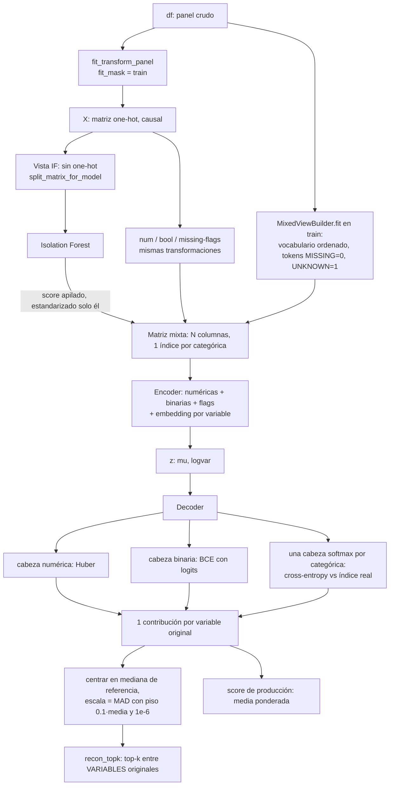

# Variational Autoencoder (VAE) — Concept, Implementation, and Tuning

This document covers the Variational Autoencoder anomaly detector shipped in
`src/models/vae.py`: the underlying idea, this project's API around it, how it
consumes the preprocessing matrix, and how training and the Optuna tuning
routine recover from crashes. It is the sibling of
`docs/models_isolation_forest.md` and follows the same conventions
(score sign, SQLite/YAML resume, figures location).

> Las fuentes introductorias consultadas están indexadas en
> `geeksforgeeks_notes.md`; esta guía aplica el concepto al código del proyecto.

---

## 1. Concept

An **autoencoder** is a neural network that compresses its input to a compact
latent (bottleneck) code and then reconstructs it. It has two halves: an
*encoder* mapping input to the latent code, and a *decoder* reconstructing the
input from that code. Training minimizes the **reconstruction error** (here mean
squared error) between input and output. This is what makes autoencoders useful
for anomaly detection: a model trained on (mostly) normal data reconstructs
normal inputs well but reconstructs unfamiliar/anomalous inputs poorly, so a
**high reconstruction error is the anomaly signal**.

A **Variational Autoencoder (VAE)** is the generative extension. Instead of
encoding each input to a single fixed latent point, the encoder outputs the
parameters of a probability distribution over the latent space — a mean vector
`mu` and (in practice) a log-variance `logvar`. A latent code `z` is then
*sampled* from that distribution and decoded, which yields a smooth, continuous
latent space.

Two ideas make the VAE trainable and well-behaved:

- **KL divergence regularization** — the loss adds a Kullback-Leibler divergence
  term that pushes each input's latent distribution toward a prior (a standard
  Gaussian `N(0, I)`), keeping the latent space smooth and preventing collapse.
  The full VAE objective is the **ELBO (Evidence Lower Bound)**: the
  reconstruction log-likelihood minus the KL divergence. Maximizing the ELBO —
  equivalently, minimizing `reconstruction + KL` — is a tractable proxy for
  maximizing the otherwise-intractable data likelihood.
- **Reparameterization trick** — you cannot backpropagate through a random
  sampling step directly. The sample is rewritten as `z = mu + sigma * eps`,
  with `eps` drawn from a fixed standard normal, so the randomness moves into
  `eps` and gradients flow through `mu` and `sigma`, allowing ordinary
  backpropagation.

VAEs were introduced by Kingma and Welling (2013).

Concept adapted from GeeksforGeeks:

- https://www.geeksforgeeks.org/machine-learning/variational-autoencoders/
- https://www.geeksforgeeks.org/machine-learning/role-of-kl-divergence-in-variational-autoencoders/
- https://www.geeksforgeeks.org/numpy/types-of-autoencoders/

### The beta knob

This project's loss is `reconstruction + beta * KL`. `beta = 1` is the vanilla
VAE (the plain ELBO). `beta != 1` is the **beta-VAE**, which trades
reconstruction fidelity against latent regularization/disentanglement:
higher `beta` weights the KL term more (smoother, more regularized latent,
looser reconstruction); lower `beta` favors reconstruction. `beta` is a tunable
hyperparameter (see §4).

---

## 2. This project's implementation

`src/models/vae.py` exposes `VAEModel` (the raw PyTorch module) and
`VAEDetector`, a project-consistent, sklearn-ish detector that mirrors
`IsolationForestDetector`: standardized score sign, `log_phase`-wrapped fit,
transparent sparse/dense input, and a torch-based `save`/`load` round-trip.

### Architecture — `VAEModel`

An MLP VAE: `encoder -> (mu, logvar) -> z -> decoder`. The encoder is a stack of
`Linear -> activation -> (optional Dropout)` blocks; two heads produce `mu` and
`logvar`; the decoder mirrors the encoder widths in reverse back to the input
dimension. In eval mode `reparameterize` returns `mu` deterministically (no
sampling noise), which makes reconstruction-error scores stable. Because the
preprocessed features are standardized/continuous (not in `[0, 1]`),
reconstruction uses **MSE / a Gaussian likelihood**, not Bernoulli/BCE.

### Score convention (important)

Throughout this project the anomaly score follows **higher = more anomalous**,
identical to the Isolation Forest module. For the VAE the score is the per-row
reconstruction error, which already increases with anomalousness — no sign flip
is needed.

| Method | Returns | Sign convention |
| --- | --- | --- |
| `score_samples(X)` | per-row anomaly score | **higher = more anomalous** (per-row MSE reconstruction error) |
| `reconstruction_error(X)` | alias of `score_samples` | same |
| `encode(X)` | per-row latent means `mu` | for interpretability / latent plots |

Exact score (eval mode, deterministic — encoder mean, no sampling noise):

```
mu, logvar = encoder(x)
x_recon    = decoder(mu)
recon_err  = mean_j (x_j - x_recon_j)^2            # MSE over features
kl         = -0.5 * sum_j (1 + logvar_j - mu_j^2 - exp(logvar_j))
score      = recon_err + score_kl_weight * kl
```

With the default `score_kl_weight=0.0` the score is exactly the per-row
mean-squared reconstruction error. Set `score_kl_weight > 0` to blend in the
per-row KL term if desired.

### API

- `VAEDetector(latent_dim=8, hidden_dim=64, n_layers=2, dropout=0.0, beta=1.0, lr=1e-3, optimizer="adam", batch_size=256, epochs=30, weight_decay=0.0, activation="relu", hidden_dims=None, score_kl_weight=0.0, kl_anneal_epochs=10, early_stopping_patience=10, device=None, random_state=42)`
- `fit(X, checkpoint_dir="artifacts/models/vae", resume=True, val_fraction=0.1) -> self` —
  trains with per-epoch checkpointing (see §3), logged via `log_phase`.
- `score_samples(X) -> ndarray` — higher = more anomalous.
- `reconstruction_error(X) -> ndarray` — alias of `score_samples`.
- `encode(X) -> ndarray` — per-row latent means `mu`.
- `save(path="artifacts/models/vae.pt") -> str` — torch-serialize the detector.
- `VAEDetector.load(path="artifacts/models/vae.pt", device=None)` — reload it.

`vae_loss(x, x_recon, mu, logvar, beta=1.0, reduction="mean")` is exposed too and
returns `(total, recon_term, kl_term)` with `total = recon_term + beta * kl_term`.

### How it consumes the preprocessing matrix

The detector is deliberately decoupled from the data / out-of-time (OOT) logic.
It consumes an already-preprocessed feature matrix `X` — a dense `numpy.ndarray`
**or** a `scipy.sparse` matrix, exactly as produced by
`src.preprocessing.pipeline.fit_transform_panel`. Because a VAE needs dense
tensors, **sparse input is densified to `float32` internally**; the standardized,
imputed, panel-derived features the pipeline produces are exactly what the VAE
learns to reconstruct.

The `(entity_id, period)` keys are held aside by the pipeline (`keys`, returned
alongside `X`) — entity/time are keys, not features. Joining detector scores
back to the separate ground-truth file via those keys is the evaluation module's
responsibility, not this module's. Here we only `fit` on `X_train` and `score`
any `X`.

### 2b. Parameter reference (`VAEDetector.__init__`, `src/models/vae.py:315`)

Unlike the Isolation Forest, there is no upstream library default to verify
here — this architecture and its defaults are this project's own design, so
every value below is read directly from the constructor signature, current as
of 2026-08-19 against installed `torch==2.9.1+cpu` (this machine has no CUDA;
`device=None` resolves to `"cpu"`, confirmed via `torch.cuda.is_available()`).

| Parameter | Default | Meaning | Alternatives and what they change | Trade-off |
| --- | --- | --- | --- | --- |
| `latent_dim` | `8` | Width of the bottleneck `z`. | Any positive int. Optuna search space: `[4, 32]` (`src/models/vae.py:1297`). | Too small under-fits structure the reconstruction needs (everything reconstructs poorly, including normal rows, which compresses the anomaly/normal score gap); too large lets the decoder memorize idiosyncrasies of individual normal rows, which can make genuinely anomalous rows reconstruct *too* well. No closed-form optimum — this is why it is searched, not fixed. |
| `hidden_dim` / `hidden_dims` | `64` / `None` (falls back to `[hidden_dim] * n_layers`) | Width of each encoder/decoder hidden layer. `hidden_dims` overrides with an explicit per-layer list (e.g. a funnel `[128, 64]`). | `hidden_dim`: any positive int, Optuna categorical `{32, 64, 128}`. `hidden_dims`: any list of positive ints (its length then sets the effective `n_layers`). | Wider layers add capacity and compute cost together; a funnel shape (`hidden_dims`) is a specific inductive bias (progressive compression) this project's tuning does not currently search — `n_layers`/`hidden_dim` cover the uniform-width case only. |
| `n_layers` | `2` | Number of encoder blocks (decoder mirrors it). | Int in `[1, 3]` (Optuna search space); more is possible but untested here. | More layers increase representational capacity and training cost together, and add vanishing/exploding-gradient risk on this small an MLP without normalization layers (`BatchNorm` is **not** used in this implementation — see below). |
| `dropout` | `0.0` | Dropout probability after each hidden activation. | Float in `[0.1, 0.4]` (Optuna search space, `src/models/vae.py:1307` — the fit-time default stays `0.0`, but the tuner never actually explores `0.0`). | `0.0` (the untuned default) means no regularization from dropout at all — a deliberate choice given the project's own measured finding (`CONTEXT.md` "Leakage-free pipeline", numeric-transform conflict) that this VAE is already fragile to input scale. The tuned search space floors at `0.1` rather than including `0.0`, so a tuning run always explores some dropout. |
| `beta` | `1.0` | Weight on the KL term: `loss = recon + beta * KL`. `beta=1` is a vanilla VAE (proper ELBO); `beta != 1` is a beta-VAE. | Float in `[0.1, 2.0]` (Optuna search space, `src/models/vae.py:1303`). | `beta > 1` pushes the latent posterior harder toward the prior `N(0, I)` — more disentangled/regularized latents, usually *worse* reconstruction (and thus a compressed anomaly score range). `beta < 1` favors reconstruction fidelity, risking a less-regularized latent space. The range was narrowed from an earlier `[0.1, 4.0]` after measurement showed larger values degraded detection quality on this data (`CHANGELOG.md` 2026-08-01) — narrower still than that measurement suggests useful now, since the 2026-08-22 loss-scaling fix changes what a given `beta` does (see `CONTEXT.md` "Known open problems"). |
| `score_kl_weight` | `0.0` | How much of the per-row KL term (not the loss's `beta`-weighted KL, the raw per-row KL) is blended into the **anomaly score** itself (`score = recon_err + score_kl_weight * KL`). | Any float `>= 0`. Not currently searched by `tune_vae`. | `0.0` (the default and what every measured number in `CONTEXT.md` uses) means the score is *pure* reconstruction error — the project's documented convention ("VAE score is the per-row MSE reconstruction error") depends on this staying `0.0`; changing it changes what the number in every OOT Excel export actually means and would invalidate direct comparison against past measurements. |
| `lr` | `1e-3` | Adam-family learning rate. | Float, log-scale search `[1e-4, 1e-3]` (Optuna, `src/models/vae.py:1298`). | Standard exploration/stability trade-off; log-scale search reflects that the right order of magnitude matters more than the exact value. |
| `optimizer` | `"adam"` | Which `torch.optim` optimizer builds the update rule. | `{"adam", "adamw", "rmsprop"}` (`_OPTIMIZERS`, `src/models/vae.py:112`) — anything else raises `ValueError` at construction. Optuna searches all three. | `adamw` decouples weight decay from the gradient update (matters only when `weight_decay > 0`); `rmsprop` has no bias-correction term and can behave differently early in training. No single choice dominates across trials in this project's own tuning history — hence all three stay in the search space. |
| `weight_decay` | `0.0` | L2 penalty coefficient passed to the optimizer. | Any float `>= 0`. Not currently searched. | `0.0` means no explicit weight decay; the project instead regularizes primarily through `beta` (KL) and early stopping. Left available for a future ablation, not yet run. |
| `batch_size` | `256` | Rows per gradient step. | `{128, 256, 512}` (Optuna categorical). | Larger batches give smoother gradient estimates and better hardware utilization but fewer updates per epoch; on a CPU-only build (confirmed above) the practical ceiling is RAM, not a GPU. |
| `epochs` | `30` (detector default) / tuning caps each trial via `max_epochs` (`tune_vae` default `20`) | Maximum training epochs — an upper bound, not a target, because per-epoch early stopping (below) usually stops sooner. | Any positive int. | Set once as a ceiling; the real stopping decision is `early_stopping_patience`, not this number — see §3 below for the two are-not-the-same-thing early-stopping mechanisms in this project (per-epoch here, per-Optuna-trial in `TrialPatienceStopper`, added 2026-08-19). |
| `activation` | `"relu"` | Nonlinearity between hidden layers. | `{"relu", "leaky_relu", "elu", "tanh", "gelu"}` (`_ACTIVATIONS`, `src/models/vae.py:104`) — validated the same way as `optimizer`: anything else raises `ValueError` at construction. Not currently in `tune_vae`'s search space (only `optimizer` is tuned among the categorical string choices). | ReLU's dead-neuron risk (a unit stuck outputting 0 for every input) is the usual reason to reach for `leaky_relu`/`elu`/`gelu` instead; untested in this project so far -- available but not yet an ablation anyone has run. |
| `kl_anneal_epochs` | `10` (`_DEFAULT_KL_ANNEAL_EPOCHS`) | Linearly ramps the *effective* `beta` from 0 to its configured value over this many epochs, instead of applying full KL pressure from epoch 0. | Any int `>= 0`; `0` disables annealing (full `beta` from epoch 1). | Exists specifically to reduce **posterior collapse** risk: applying the full KL penalty before the decoder has learned anything useful tends to push every posterior to the prior (an uninformative latent, `mu`/`logvar` collapse to `0`/`0`), after which reconstruction error stops carrying any anomaly signal. Annealing lets reconstruction quality establish first. |
| `early_stopping_patience` | `10` (`_DEFAULT_PATIENCE`) | Stop *this trial's/this fit's* training after this many epochs with no improvement in **validation** loss (not training loss). `None` disables it (always trains the full `epochs`). | Any positive int, or `None`. | This is the **per-epoch, within-one-fit** early stopping — distinct from `TrialPatienceStopper` (`src/models/_tuning_stop.py`, added 2026-08-19), which stops the *Optuna trial loop itself* across independent hyperparameter draws. The two solve different problems and both exist simultaneously during `tune_vae`: one decides "stop training this configuration," the other decides "stop trying more configurations." Monitoring validation (not training) loss is the point — training loss keeps improving even while a VAE is beginning to overfit small noise in the training reconstruction, which validation loss will not reward. |
| `device` | `None` (auto: `"cuda"` if `torch.cuda.is_available()` else `"cpu"`) | Torch device the model and tensors live on. | Any valid torch device string, or `None`. | On this machine (`torch==2.9.1+cpu`, no CUDA), `None` always resolves to `"cpu"` — confirmed by direct check, not assumed. |
| `random_state` | `42`, threaded from `PipelineConfig.seed` | Seeds `numpy`/`torch` (`torch.manual_seed`, `torch.cuda.manual_seed_all`) before weight init and shuffling. | Any int. | GPU reproducibility is **not guaranteed** even with a fixed seed (cuDNN's algorithm selection can be non-deterministic) — the docstring `_seed_everything` is explicit about this being CPU-reproducible only, which matches this project's actual (CPU) execution environment. |

**Not exposed as a tunable / architectural default worth flagging:** there is
**no `BatchNorm`/`LayerNorm`** anywhere in `VAEModel` — normalization is not
part of this architecture. This matters for `n_layers`/`dropout` sensitivity:
without normalization layers, deeper stacks are more exposed to internal
covariate shift, which is part of why `n_layers` tops out at 3 in the search
space rather than going deeper.

**Sensitivity analysis actually run vs. still open.** Covered at the time:
finite loss/gradients under both default and edge-case configs, KL
annealing reaching its configured `beta` on schedule, early-stopping firing
and restoring best weights, and checkpoint resume correctness. `CHANGELOG.md`
(2026-08-01) records one real sensitivity finding — the `beta`/numeric-transform
conflict between the two detectors. **Not yet measured**: an isolated
`latent_dim` sweep or a `dropout`-on-vs-off ablation at fixed
everything-else; both remain Optuna-searched rather than independently
characterized.

**Note on the loss scaling this table describes.** The `beta` behaviour
above (and the `CONTEXT.md`/`CHANGELOG.md` numeric-transform conflict it
references) predates a 2026-08-22 fix to `vae_loss`'s reduction, which
changed what a given `beta` value actually does — see `CONTEXT.md` "Known
open problems" before reusing any `beta` conclusion drawn before that date.

---

### 2c. Mixed-type VAE: embeddings instead of one-hot (2026-09-25)

**Problem it solves.** With one-hot inputs every level of a categorical variable is an independent
reconstruction feature. A 40-level variable contributes 40 terms, a mostly-zero column has a tiny robust scale
(MAD) and the diagnostic's `recon_topk` ends up selecting *dummy columns*, not business variables: on the synthetic
panel 93–96 % of the top-5 slots were one-hot columns (65 % of the columns) and `recon_topk` had the same AP as
chance (0.018 vs a 0.013 base rate). `vae.categorical_representation: embedding` replaces them without dropping
any categorical variable.

**Two views of the data (the IF is untouched).**

* *IF view* — as before (`split_matrix_for_model`: one-hot columns withheld).
* *VAE view* (`src/preprocessing/mixed_view.py`) — the continuous, binary and missing-flag columns are taken from
  the very same causal preprocessing; each categorical variable becomes **one integer index column**, built from the
  *raw* panel column so nulls are visible. Index `0` = MISSING, `1` = UNKNOWN (a level the fit rows did not have, or one
  rarer than `rare_min_frequency`), `2..` = the vocabulary **sorted alphabetically** (independent of the row order).
  Vocabularies are learned on the **train rows only**; a level that first appears in validation/OOT is UNKNOWN there,
  never a silent normal category. No `cat__<level>` dummy column reaches the VAE (`assert_no_onehot`, observability
  check `vae.no_onehot_input`). `categorical_encoding` is not changed for anyone else.
  **Null in a binary column.** The pipeline only casts booleans to float, so a null arrives as `NaN`, and a binary column
  has neither a MISSING token nor a missing-flag. The view scores it as `False` (found by the end-to-end run: the
  sensitivity "null" scenario on a boolean input otherwise aborted the whole phase). A `NaN` in a *numeric* or flag column
  is still refused by the detector: those are imputed upstream. The one-hot architecture does not have this guard — it lets
  the `NaN` through and **every** score of that scenario is `NaN` (1500 of 1500 in the synthetic run, scenario
  `null::is_digital_active`). The post-training sensitivity phase therefore skips any scenario with non-finite scores
  (named in `sensitivity_summary.json` → `skipped_non_finite_scenarios`, and logged) instead of ranking it: before this,
  that NaN became `leverage 102.3` and "INDISPENSABLE — conservar" for the variable, while with embeddings the same variable
  came out "MARGINAL — candidata a eliminación".

**Architecture** (`src/models/mixed_vae.py`, `architecture = mixed_v1`).

* Encoder input: `[numeric | binary | missing-flags | embedding(cat_1) … embedding(cat_k)]` → MLP trunk → `mu`, `logvar`.
  Embedding width per variable: `auto` = `round(1.6 · cardinality^0.56)` clipped to `[min_dimension, max_dimension]`
  (or `fixed`).
* Decoder heads: numeric (linear), binary (logits) and **one logit vector per original categorical variable**. Embedding
  vectors are never reconstructed; the categorical head is evaluated against the true index.
* Loss per row = `w_num·Σ Huber(x, x̂) + w_bool·Σ BCE_with_logits + w_cat·Σ CE(cat, logits) + β·KL` (Huber or MSE for
  numeric). Default weights are all `1.0`: a variable is one term whatever its encoding, so the weights depend neither
  on the number of categories nor on the number of columns the one-hot used to generate. β and the KL ramp are unchanged.
  Training history records numeric / boolean / categorical loss, the loss of **each original categorical variable**, KL and
  the total (`history_[i]["train_parts"]`, `["val_parts"]`).
* Missing-value flags (`missing__*`) are encoder inputs only: they are not original variables, so they are neither
  reconstructed nor scored.

**Anomaly score and `recon_topk`.** Exactly **one contribution per original variable**: Huber/MSE (numeric), BCE
(binary), negative log-likelihood of the observed category (categorical; MISSING/UNKNOWN keep their own identifiable
contribution). `VAEDetector.score_samples` = weighted mean of the contributions. The NLL is floored at probability 1e-6
(`NLL_CAP` = 13.8155), so a token never seen in training cannot give an unbounded value. The diagnostic frames carry one
column per **original variable** (never embedding dimensions, logits or dummies); `recon = value + contribution` makes the
suite's `|x − recon|` exactly that contribution.

*Normalisation* (`ifvae_diag.scoring.residual_contributions(..., scale_floor_fraction=0.1, center=True)`, on for the mixed
architecture only): every contribution is **centred at its variable's reference median** (`max(c − median_ref, 0)`) and then
divided by the robust scale (MAD of the centred excess, falling back to its mean), with a floor of **0.1 × the mean of the centred
excess of the reference and an absolute 1e-6** (`CONTRIBUTION_FLOOR_FRACTION`, `CONTRIBUTION_ABS_FLOOR`; the detector keeps the same statistics as
`ContributionReference`, fitted on the fit rows without the validation months and persisted in the payload). Calibration uses the **train block only**.
Known limit: a variable whose reference excess is essentially zero (a uniform many-level variable, or one that is 99.8 % one value) is normalised by a
tiny scale, so a small real change in it is amplified up to the absolute floor; in the trained models measured here this stayed at ~5–10 units like the other
variables. Centring matters because NLL/BCE are not
centred at zero like `|x − x̂|`: without it a discrete or constant contribution monopolises the top-k (measured on a controlled
panel: categorical variables of 2, 10 and 40 levels took 100 %, 63 % and 100 % of the top-3 slots against 6–11 % for numeric
ones; centred they take 38 %, 52 % and 59 % against 37–39 %, expected 43 %). The floor stops a variable that the model
reconstructs almost perfectly (MAD ≈ 0) from exploding a tiny difference.

**Checkpoints and identity.** `save` writes `architecture`, `architecture_version`, the layout and the loss/embedding config;
`architecture_fingerprint` = hash of variable names and order, vocabularies and cardinalities, embedding dimensions, loss types
and weights, token policy and architecture version. It enters the checkpoint-compatibility test (a checkpoint is resumed only
if the whole training config **and** the data fingerprint match), the Optuna study name and the YAML. **One-hot payloads/checkpoints
are rejected explicitly, never loaded partially** (`IncompatibleCheckpointError`); so are mixed payloads of another
architecture version or fingerprint. `VAEDetector.load(path, expect_architecture=..., expect_fingerprint=...)` is what `main.py`
uses; an expected fingerprint against a one-hot payload and unknown keys in the stored loss/embedding config are also rejected (never a partial load).
When `fit(resume=True)` finds a checkpoint of another architecture/config in its directory it is **moved aside** (`checkpoint.pth.incompatible-<architecture>`),
never overwritten, so switching `vae.categorical_representation` cannot destroy the other model's resume state. Inputs are validated: non-finite numeric
values and binary columns other than 0/1 are refused instead of silently clipped. `tune_vae(layout=..., mixed_config=...)` supports partial labels (`NaN` = unknown; only known held-out rows are scored, with a
visible fallback to the ELBO objective when there are fewer than `min_eval_positives`).

**Configuration** (`configs/pipeline.yaml`, `vae:`; CLI `--vae-categorical-representation`). `onehot` is kept as the migration path
and as the control of the A/B comparison. **The production default stays `onehot` until every acceptance criterion is met** (below).

**Consumers.** Reconstruction-error attribution and per-row explanations rank variables by the **normalised** contribution (train reference) — ranking raw
values would let the NLL of a uniform 40-level variable (log 40) sit in the top-5 of every row — and use the original variable names, and for a categorical
variable the observed category and its reconstructed probability (`segment=retail (p=0.031)`; commas inside a category become `;` because the dashboard splits on
commas). The attribution chart axis says "contribución normalizada media por variable original". Limits: the missing-value flags are encoder inputs only, so an
unexpected missing numeric no longer has its own reconstructed term (it did as a one-hot-era matrix column); the vendored suite's drift statistics see category
*indices* as numbers (read them with care for categoricals). `categorical_sources` is exactly the pipeline's categorical branch (`object`/`category` dtypes), so
embeddings cover the same variables one-hot did; levels are matched by their string form (`1` and `'1'` are the same level); the sensitivity study re-encodes
perturbed frames with the same vocabularies (nulls → MISSING); the §9 families (capacity, beta/KL, loss by type — now expressed in
original variables with MISSING/UNKNOWN rows and a one-hot control —, ablation with a sub-layout, backtests with a vocabulary rebuilt
per origin from earlier periods only, window stability) all run with either architecture.

**Validated comparison** (`tools/compare_vae_representations.py`; report in `docs/validation/2026-09-25_vae_representations/`).
Same panel, temporal splits, seeds, training rows, epochs (20), KL ramp, alert budget (top-5 % of the OOT rows) and no IF stacking; the
reconstruction losses are **not** compared (different scales). Every `recon_topk` figure is computed with **two normalisations applied to both
arms** — *historical* (`|residual|/MAD`) and *centred + floor* — so the representation is never confounded with the normalisation (an independent review
showed that centring alone lowers the one-hot arm's categorical share from 95 % to 70 %). The pipeline as it would run is A-historical vs B-centred; the
like-for-like pair is centred vs centred. Two independent synthetic panels (600 entities × 14 periods), 5 seeds each (data seed 42 / 7):

| Metric | A: one-hot | B: embeddings |
|---|---|---|
| VAE input columns / reconstruction terms per row | 66 / 66 | **29 / 24** (one per original variable) |
| AP of the alert score `recon_topk` — pipeline as-is (A historical, B centred) | 0.018 / 0.018 | **0.224 / 0.220** |
| AP of `recon_topk` — same (centred) normalisation | 0.019 / 0.020 | **0.224 / 0.220** |
| AP of `recon_topk` — same (historical) normalisation | 0.018 / 0.018 | **0.288 / 0.311** |
| AP, production score (Excel) | 0.043 / 0.063 | **0.112 / 0.133** |
| tail separation, `recon_topk` (pipeline as-is / centred for both) | 1.41 / 2.07 (42) | **2.99 / 2.99** (42) |
| tail separation, production score (Excel) | **2.53 / 2.20** | 1.62 / 1.54 |
| seed stability, Jaccard of alerts (pipeline as-is / centred for both) | 0.46 / 0.80 (42) | **0.90 / 0.90** (42) |
| top-k slots on categorical terms, centred for both (expected by original variables: 25 %) | 72 % / 73 % | **34 % / 35 %** |
| slot-rate spread max/min among categoricals, drift-free reference block, centred for both | 1.44× / 1.49× | **1.24× / 1.14×** |
| same spread with the *historical* normalisation | 2.2× / 2.1× | **5.0× / 9.3×** (centring is required for B) |
| window stability, Spearman — literal (A complete, pipeline as-is) | **0.78 / 0.80** | 0.41 / 0.38 |
| window stability, Spearman — like-for-like (numeric variables only) | 0.25 / 0.25 | **0.39 / 0.35** |
| window stability, top-K Jaccard — literal | **0.22 / 0.29** | 0.05 / 0.04 |
| active latent units (of 8) | 8 / 8 | 6.6 / 6.4 |
| fit time (s) / peak RSS Δ (MB) | 7.4 / 12 | **3.0 / 1.9** |
| never-seen category | no error (implicit bucket) | no error (explicit UNKNOWN, score +0.18) |

What holds: no one-hot column enters the VAE, one contribution per variable, no errors on unseen categories, incompatible checkpoints rejected, no
temporal leakage (vocabularies ⊂ train levels, normalisation reference = the 3 600 train rows), AP and seed stability better, categorical share of the top-k
and its spread between variables lower **also under the same normalisation**. **Three criteria fail, so `onehot` remains the default:**
(1) the tail separation of the *production* score is lower (1.62 vs 2.53) — its AP is higher (0.112 vs 0.043) and tail separation only measures the shape
of a distribution, but by the letter of the criteria it blocks; (2)–(3) window stability judged *literally* against the complete one-hot arm (Spearman
0.41 vs 0.78; top-K Jaccard 0.05 vs 0.22) — the one-hot number is inflated by time-invariant categorical attributes (an entity's category repeats every
month), and like-for-like (numeric variables only) B is *higher* (0.39 vs 0.25), but the literal criterion is not met. Changing the default is one line
(`vae.categorical_representation: embedding`) once these trade-offs are accepted. Synthetic data only.



## 3. Training, checkpointing, and crash recovery

`VAEDetector.fit` builds a shuffled train/validation split (`val_fraction`,
default 0.1) from a densified copy of `X`, trains for `epochs`, and reports
per-epoch train/val loss.

### Per-epoch `checkpoint.pth`

After **every** epoch, `<checkpoint_dir>/checkpoint.pth` is written atomically
(`.tmp` + `os.replace`) containing:

- the model `state_dict`,
- the optimizer `state_dict`,
- the just-completed epoch index,
- the best (lowest) monitored loss so far,
- the full architecture/hyperparameter config,
- the per-epoch training `history`,
- the numpy + torch RNG state.

`<checkpoint_dir>/best_model.pth` separately tracks the lowest-monitored-loss
weights (validation loss when a val split exists, otherwise train loss).

### Resume semantics

With `resume=True` (default) and a **compatible** checkpoint present, the model,
optimizer, history, and RNG state are restored and training continues from
`epoch + 1`. *Compatible* means the whole training run matches, not only the
architecture: `input_dim`, `latent_dim`, `hidden_dim`/`hidden_dims`, `n_layers`,
`dropout`, `activation`, **`beta`, `lr`, `optimizer`, `batch_size`, `weight_decay`,
`score_kl_weight`, `kl_anneal_epochs`, `random_state` and a fingerprint of the
training matrix and validation split**. (`epochs` and the patience are excluded on
purpose: extending the budget of the same run is a legitimate resume.) An
incompatible or legacy checkpoint (written before these keys existed) is ignored
with a warning and training starts fresh. If the checkpoint is already at/after
`epochs`, training is skipped. At the end of `fit`, the best weights are restored.

`fit` refuses `epochs < 1`. `save`/`load` persist and restore `epochs`,
`kl_anneal_epochs` and `early_stopping_patience` (an old payload falls back to the
length of its history); before this, `load` rebuilt the detector with `epochs=0`, so
any refit cloned from a loaded model (the diagnostic's stability refits) silently
trained nothing or a different model.

> The internal `torch.load` calls (checkpoint resume, best-weight restore, and
> `VAEDetector.load`) pass `weights_only=False`. PyTorch >= 2.6 defaults to
> `weights_only=True`, which refuses to unpickle the config dict and numpy RNG
> state carried by these trusted project checkpoints. This is required for
> checkpoint resume to work.

### Optuna study resume

`tune_vae` (see §4) creates its study against a **persistent SQLite RDBStorage**,
default `sqlite:///artifacts/tuning/optuna_vae.db`, with `load_if_exists=True`. The study
name is `vae_<fingerprint>` (matrix shape, feature names, validation split, objective
mode/direction, `max_epochs`, seed, label hash), so a changed dataset, split or objective
starts a **new** study instead of silently resuming an incomparable one (before, the name
was the fixed string `vae`). `n_trials` is the **total budget**: a re-run only runs
`n_trials − completed`, and trials a crash left `RUNNING` are closed as failed. Each trial
trains in `checkpoint_dir/<study_name>/trial_<n>`, so neither trials nor studies share
checkpoints. The deployed refit uses the winning trial's `epochs` **and its KL ramp**
(`_kl_anneal_for(epochs)`; it used the default 10-epoch ramp before), and the YAML
records `kl_anneal_epochs` and `status: final` once the refit is saved.

`main.py` treats a failed tuning as an incident (`tuning.vae_completed`), fits the default
VAE and does **not** read a best-params YAML left by an earlier run.

### Outputs

| Artifact | Default path |
| --- | --- |
| Per-epoch training checkpoint | `artifacts/models/vae/checkpoint.pth` |
| Best-weights checkpoint | `artifacts/models/vae/best_model.pth` |
| Saved detector (`VAEDetector.save`) | `artifacts/models/vae.pt` |
| Optuna SQLite study | `artifacts/tuning/optuna_vae.db` |
| Best params (incremental YAML) | `artifacts/tuning/best_params_vae.yaml` |
| Refitted best detector (from `tune_vae`) | `artifacts/models/vae_best.pt` |
| Per-trial tuning checkpoints | `artifacts/models/vae_tuning/trial_<n>/` |
| Figures | `artifacts/reports/figures/` |

---

## 4. Tuning

`tune_vae(X, n_trials=30, y=None, ...)` runs an Optuna study over the detector's
hyperparameters, then refits the best configuration on all of `X` and saves it to
`artifacts/models/vae_best.pt`. The current best hyperparameters are checkpointed to
`artifacts/tuning/best_params_vae.yaml` (atomic write) after **every** completed trial,
so the best-so-far config is always durable on disk.

### Search space

- `latent_dim` — int in `[4, 32]`
- `lr` — float in `[1e-4, 1e-3]` (log scale)
- `optimizer` — `{"adam", "adamw", "rmsprop"}`
- `batch_size` — `{128, 256, 512}`
- `beta` — float in `[0.1, 2.0]`
- `dropout` — float in `[0.1, 0.4]`
- `n_layers` — int in `[1, 3]`
- `hidden_dim` — `{32, 64, 128}`
- `epochs` — int in `[1, max_epochs]` (small budget for tuning speed)

### Objective modes and direction handling

- **Supervised** (`y` given, 0/1 labels aligned row-for-row to `X`): the
  objective is the **PR-AUC** (`average_precision_score`, the default) of the
  reconstruction-error scores vs. the labels — the informative summary for
  heavily imbalanced anomaly detection — switchable to **ROC-AUC** via
  `objective_metric="roc_auc"`. When `direction is None` it is auto-set to
  `"maximize"`.
- **Unsupervised** (`y is None`): the objective is the **validation
  reconstruction loss** (the best epoch's val loss; lower is better). When
  `direction is None` it is auto-set to `"minimize"`.

`objective_metric` may also be a callable `(detector, X) -> float` for a fully
custom objective; with a callable and `direction is None` the direction defaults
to `"maximize"` (override explicitly if needed).

### Figures

`plot_reconstruction_error(scores, ...)` writes a histogram of the per-row
reconstruction-error scores (overlaying normal vs. anomaly when labels are
supplied), and `plot_latent_space(detector, X, ...)` scatters a 2D PCA of the
encoder means. Both land in `artifacts/reports/figures/` per the project-wide figures
rule.

---

## 5. Minimal usage

Fit-then-score on the preprocessed matrix (unsupervised; `score_samples` is the
per-row reconstruction error, higher = more anomalous):

```python
from src.data import load_or_generate_panel
from src.preprocessing import fit_transform_panel
from src.models import VAEDetector

# 1. Load (or generate) the panel and preprocess it.
df, schema = load_or_generate_panel(
    data_path="artifacts/data/data.csv", n_individuals=1_000, n_periods=10, seed=42
)
X, keys, feature_names = fit_transform_panel(df, schema)

# 2. Fit the VAE. Per-epoch checkpoints land in artifacts/models/vae/; re-running with
#    resume=True continues from the last epoch after a crash.
detector = VAEDetector(latent_dim=8, hidden_dim=64, n_layers=2, beta=1.0, epochs=30)
detector.fit(X, checkpoint_dir="artifacts/models/vae", resume=True, val_fraction=0.1)

# 3. Score: higher = more anomalous.
scores = detector.score_samples(X)          # == detector.reconstruction_error(X)
latents = detector.encode(X)                 # per-row latent means (for plots)

# 4. Persist / reload.
detector.save("artifacts/models/vae.pt")
detector = VAEDetector.load("artifacts/models/vae.pt")
```

Optuna tuning (SQLite study -> `artifacts/tuning/optuna_vae.db`; re-run to resume):

```python
from src.models import tune_vae

# Unsupervised: objective = validation reconstruction loss (auto 'minimize').
study = tune_vae(X, n_trials=25)

# Supervised: pass 0/1 labels aligned to X rows -> PR-AUC objective (auto
# 'maximize'); switch to ROC-AUC with objective_metric="roc_auc".
# study = tune_vae(X, n_trials=25, y=labels)

# Best params stream to artifacts/tuning/best_params_vae.yaml every trial; the refitted
# best detector is saved to artifacts/models/vae_best.pt.
best = VAEDetector.load("artifacts/models/vae_best.pt")
scores = best.score_samples(X)
```

To get 0/1 labels for the supervised objective, join the separate ground-truth
file to `keys` on `(entity_id, period)` (evaluation-side; see the Data contract
in `CONTEXT.md`). See `src/models/vae.py` docstrings for the full API.
