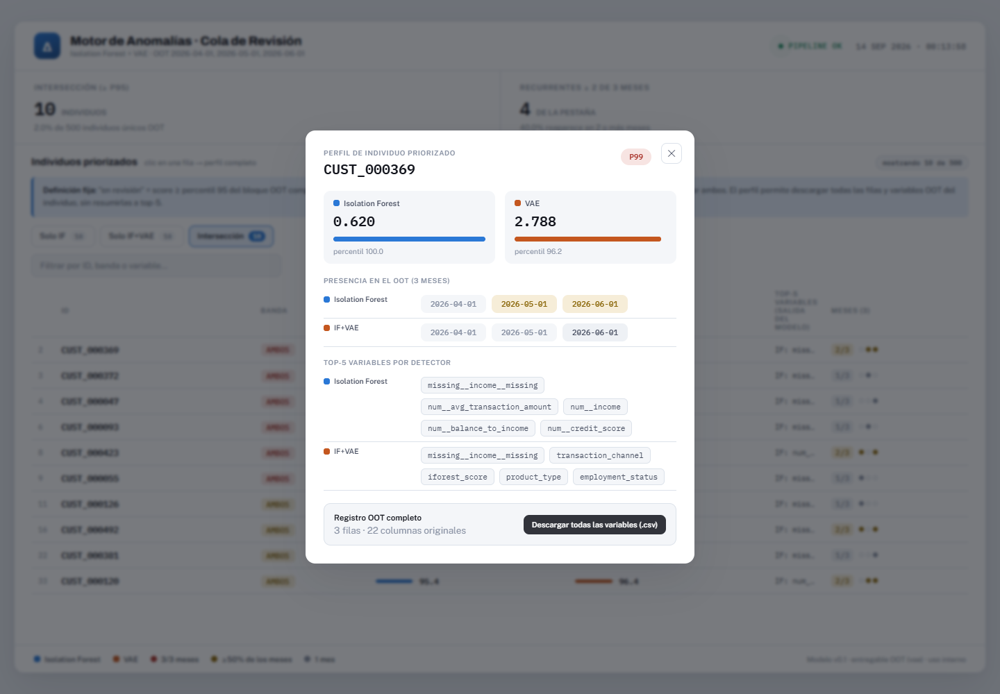
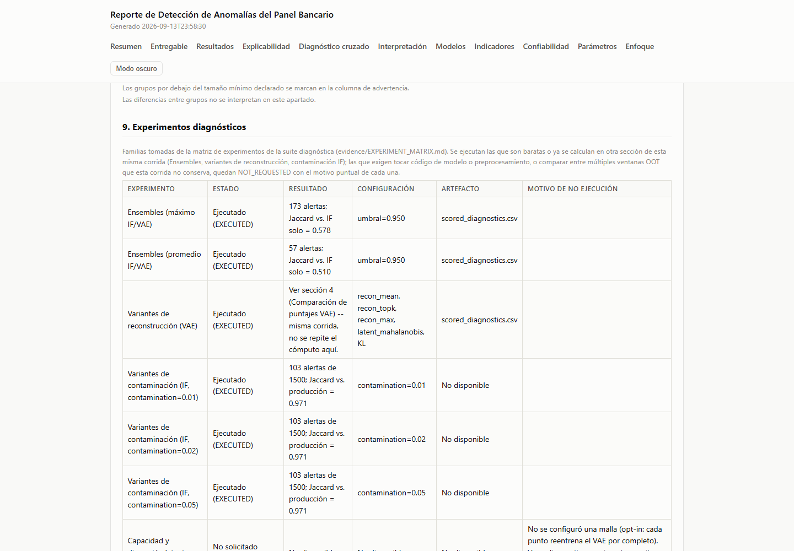
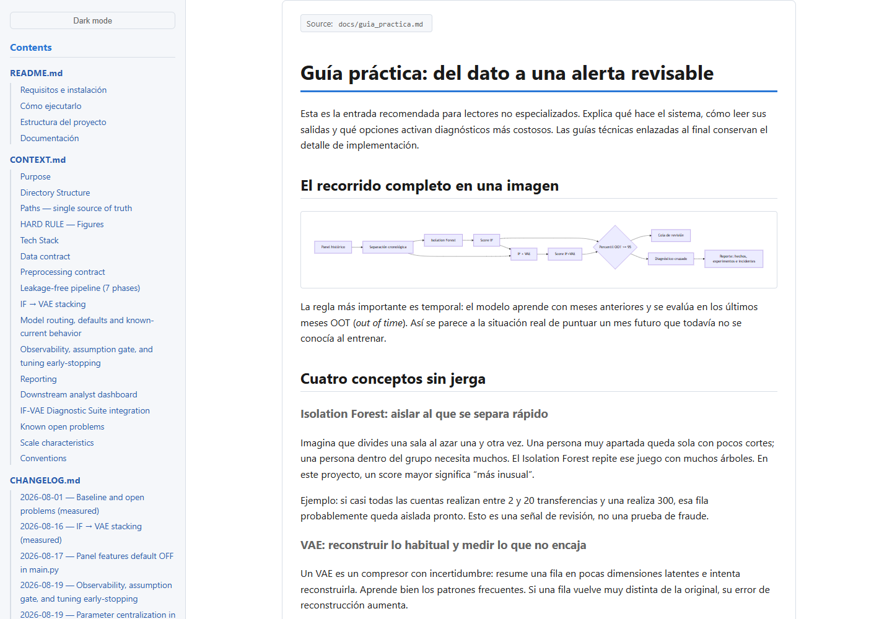

# Validación visual — 2026-09-14

Ejecución real con Playwright usando Chrome instalado, viewport 1440 × 1000.
El script reproducible es `tests/validate_visuals.cjs` y el resultado estructurado
está en `visual-validation.json`.

## Iteración 1 — dashboard

- Pestañas verificadas: 16 Solo IF, 16 Solo IF+VAE, 10 Intersección.
- Perfil abierto con `entity_id` real.
- Descarga ejecutada: CSV de 3 filas OOT × 22 columnas originales.
- Errores JavaScript: 0.

## Iteración 2 — reporte

- Seis filas `EXECUTED` visibles en §9.
- Sección de incidentes ausente porque no hubo ERROR/CRITICAL.
- Los WARNING de la corrida no se renderizan en el reporte.
- Errores JavaScript: 0.

## Iteración 3 — documentación

- Tres bloques Mermaid convertidos a SVG.
- Guía práctica y ejemplos visibles en navegador real.
- Errores JavaScript: 0.

La primera pasada visual detectó dos problemas que ya están corregidos: un
escape `\r\n` que invalidaba el JavaScript de descarga, y el uso de la clave
interna del perfil (`p2`) en lugar del `entity_id` visible. La pasada final que
produjo estas capturas no presenta ninguno de los dos.
